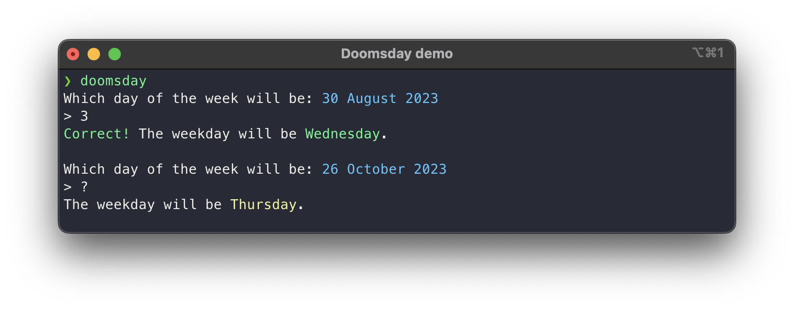

# DoomsdayRule

This package implements the algorithm for **determining the day of the week** for any date.

The algorithm is was devised by the mathematician John Conway to be calculated mentally.

It's easy and uses remainders of 7 (because we only care about the weekday) to make big numbers small.

## Command line trainer

There is a command line training program. You can run it with `swift run` or:
```sh
swift build
.build/debug/doomsday --help
# you can copy the binary to your $PATH
cp -f .build/debug/doomsday ~/.local/bin/
doomsday
```

Here is how the the REPL looks:



By typing more `?` you will get more detailed explanation:


Don't worry if that explanation seems too complicated!
You will rarely need to calculate the anchors for year
and century, so only the last easy step is necessary.
